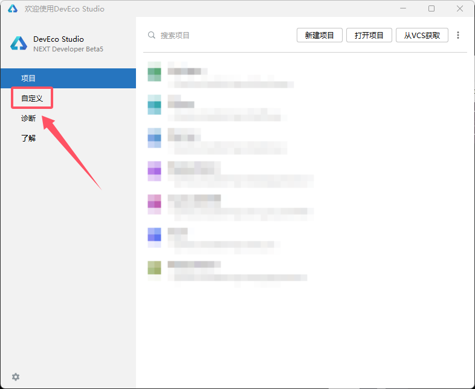
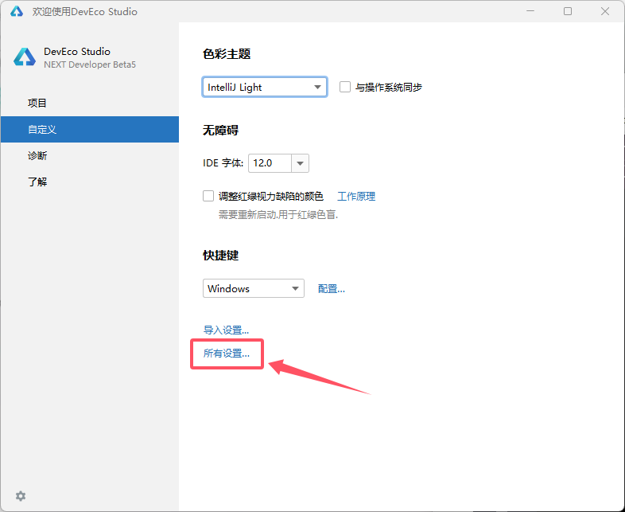
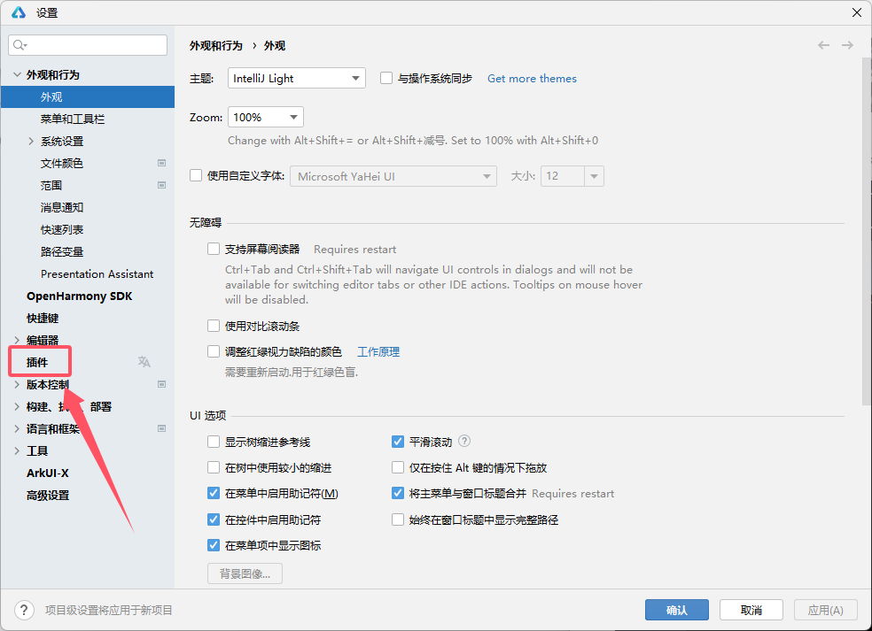
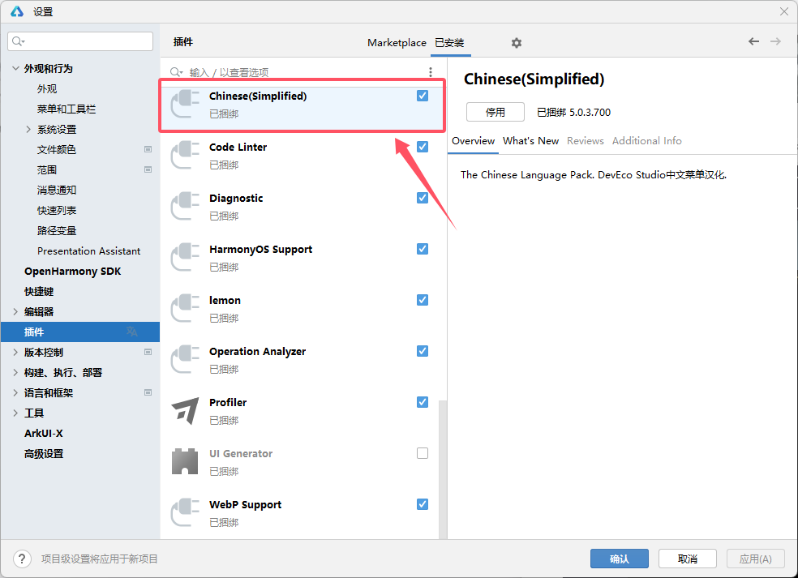
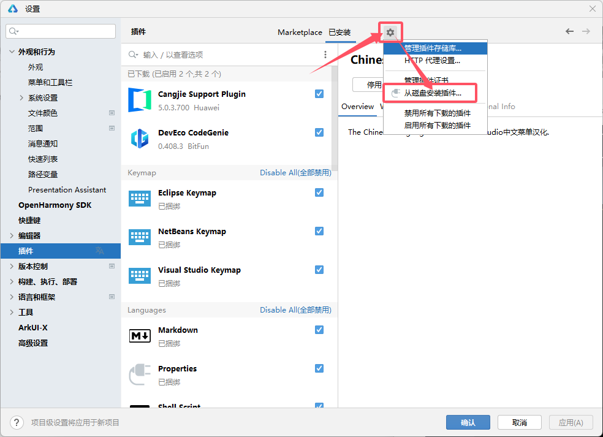
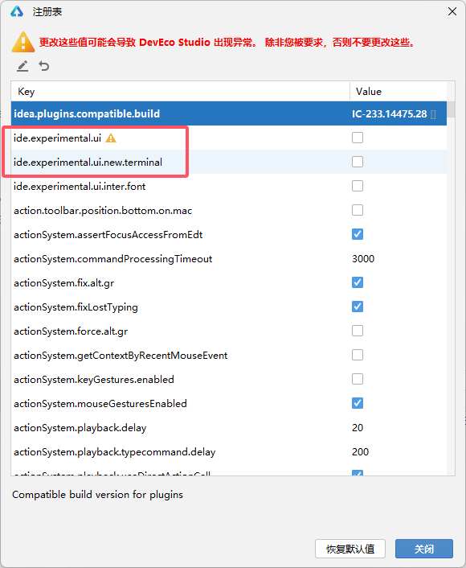
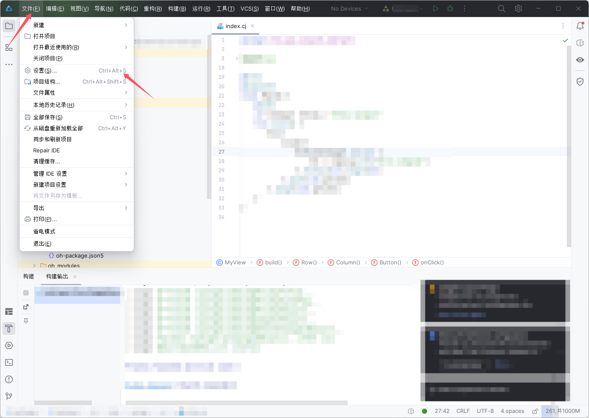

# DevEco 设置

> DevEco Studio 主要针对应用开发场景，若要开发控制台应用请选择 SDK。

## 安装

访问[该页面](https://developer.huawei.com/consumer/cn/download/)以下载 DevEco Studio。

您需要同时下载 `DevEco Studio NEXT Developer BetaX(X.X.X.XXX)`（本体） 与 `DevEco Studio NEXT Developer BetaX-Cangjie Plugin(X.X.X.XXX)`（仓颉插件）。

> 请注意，插件仅能在您通过申请后下载。

下载完成后，首先解压 `DevEco Studio NEXT Developer BetaX(X.X.X.XXX)` 并进行安装。

安装完成后，按照如下步骤安装插件。

::: danger
请不要解压插件包。
:::

::: details 插件安装
打开 DevEco 后，选择 “自定义”（`Customize`） 选项卡。

打开 “所有设置”（`All settings...`）

打开 “插件”（`Plugins`）

> 如果您想启用简体中文页面，请向下滑动找到该插件并启用
> 

点击齿轮，选择 “从磁盘安装插件”（`Install Plugin from Disk...`）

选择您的插件包即可完成安装。
:::

## 创建项目

请务必选择 `[Cangjie] Empty Ability` 进行创建。

## 运行项目

在项目运行前，需要下载模拟器。（模拟器需另外申请）

`Windows` 平台中，你可能会遇见如下错误

~~~plain{2}
Install Failed: error: failed to install bundle.
code:9568347
error: install parse native so failed.
View detailed instructions.
...
...
Error while Deploy Hap
~~~

此时需要在 `entry/build-profile.json5` 中修改如下内容：
~~~json
{
  "apiType": "stageMode",
  "buildOption": {
    "cangjieOptions": {
      "path": "./src/main/cangjie/cjpm.toml",
      "abiFilters": ["x86_64"] // [!code ++]
    }
  },
  "buildOptionSet": [
  ],
  "targets": [
    {
      "name": "default"
    }
  ]
}
~~~

完成修改后即可构建。

---

## 附：启用新 UI

::: details 启用方式
在 IDE 中双击 `shift`，搜索 `注册表`，选择 `注册表 ...`。

勾选这两项并重启 IDE：

此时新 UI 已启用，但右侧的 `设备管理器` 不见了。

你可以在 `工具` 菜单下找到，或使用以下方式配置：
::: details 配置
打开`设置 -> 菜单和工具栏 -> 主工具栏 -> Right`

点击上方的 `+`，点击 `添加操作`，在顶部搜索 `设备管理器` 并选中，点击确认添加。

将其拖拽至 `Right` 的最顶部即可。

:::